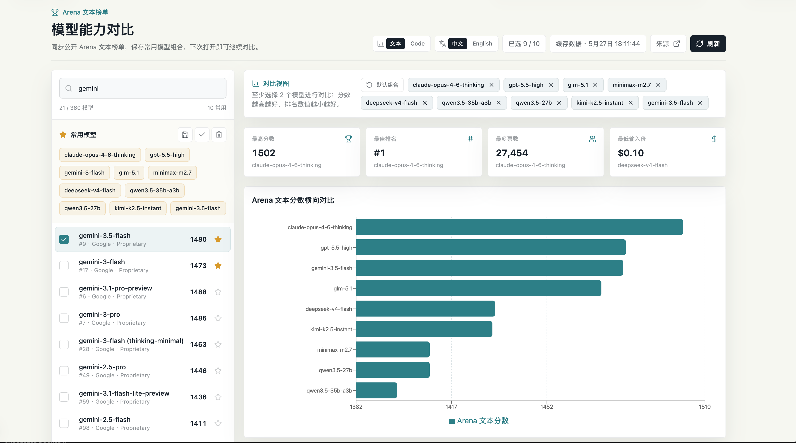

# LLM Arena Compare / LLM Arena 模型对比

[English README](../README.md)

[在线体验](https://llm-arena-compare.vercel.app)

LLM Arena Compare 是一个本地优先的模型对比仪表盘，用于对比 Arena 公开 Text 和 Code 榜单中的指定模型。你可以搜索模型、保存常用模型组合、刷新实时榜单分数，并通过图表对比排名、分数、票数、价格和上下文窗口。



## 功能亮点

- 从 `https://arena.ai/leaderboard/text` 同步公开 Arena 文本榜单。
- 从 `https://arena.ai/leaderboard/code/webdev` 同步公开 Arena Code WebDev 榜单。
- 支持搜索模型，并选择最多 10 个模型进行横向对比。
- 使用浏览器 `localStorage` 保存常用模型、当前选择、当前榜单和界面语言。
- 应用默认中文界面，并提供 `中文 / English` 语言切换按钮。
- 提供区分榜单类型的 Arena 分数横向柱状图、摘要卡片、排名/票数图表和明细表格。
- 服务端使用 5 分钟内存缓存，避免频繁请求 Arena 页面。

## 技术栈

- Next.js 16
- React 19
- TypeScript
- Tailwind CSS
- Recharts
- Cheerio
- lucide-react

## 快速开始

环境要求：

- Node.js `>=20.9.0`
- npm

1. 克隆仓库并进入项目目录：

```bash
git clone https://github.com/tianyu0413/llm-arena-compare.git
cd llm-arena-compare
```

2. 安装依赖：

```bash
npm install
```

3. 执行项目检查：

```bash
npm run check
```

4. 启动开发服务器：

```bash
npm run dev
```

5. 打开应用：

```text
http://localhost:3000
```

6. 本地生产构建和运行：

```bash
npm run build
npm run start
```

如果你已经在本地拥有源码，请先进入项目目录：

```bash
cd /path/to/llm-arena-compare
```

## API

应用提供两个本地 API 路由：

```text
GET /api/arena/text
GET /api/arena/code
```

返回结构：

```ts
{
  sourceUrl: string;
  fetchedAt: string;
  cached: boolean;
  models: ArenaModel[];
}
```

这不是 Arena 官方 API。它解析 Arena 公开榜单 HTML；如果 Arena 页面结构变化，解析逻辑可能需要维护。

## 数据来源和限制

- 当前覆盖 Arena 文本榜单和 Arena Code WebDev 榜单。
- 数据来自公开榜单页面，不是私有或官方 API。
- 服务端缓存是内存缓存，每个部署实例会维护自己的 5 分钟短期缓存。
- 如果 Arena 改变公开 HTML 结构，解析器可能需要更新。
- 如果需要调整同步节奏，可以修改 `lib/arena.ts` 中的 `CACHE_TTL_MS`。

## 路线图

- 支持更多 Arena leaderboard 分类。
- 将选中的对比数据导出为 CSV。
- 增加价格、上下文窗口和投票置信度等图表模式。
- 在引入持久化数据库后支持历史快照。

## 贡献

参见 [CONTRIBUTING.md](../CONTRIBUTING.md)。

## 许可证

MIT
